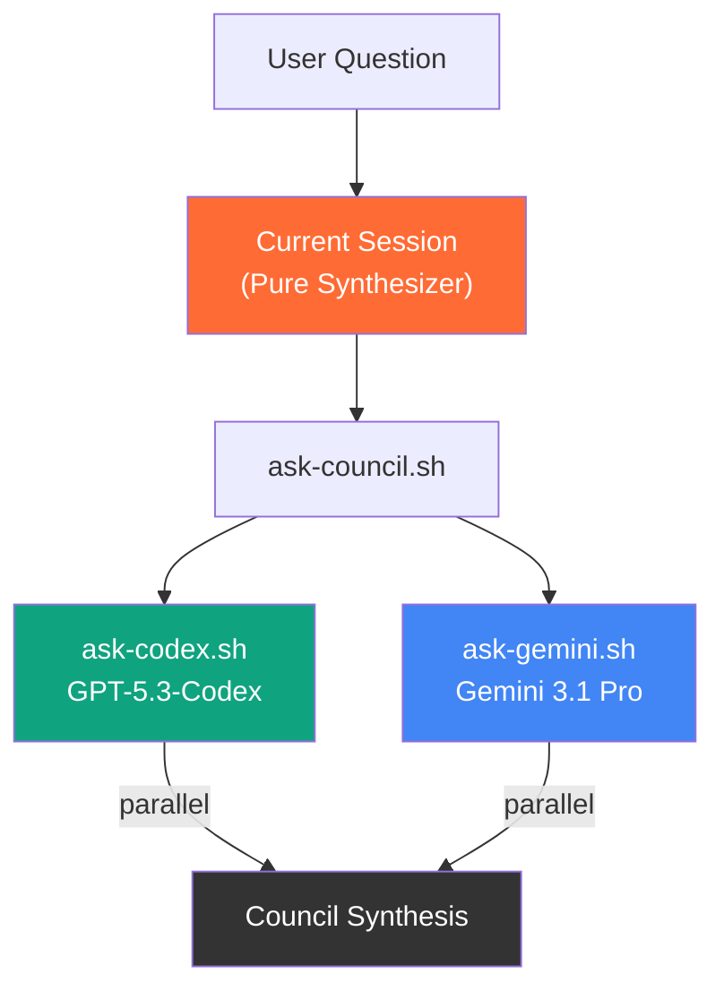

# Dual LLM Council (Codex + Gemini)

**Run GPT-5.3-Codex + Gemini 3.1 Pro in parallel, synthesize the best answer.**

> Claude 토큰 소진을 대비하여, OpenAI Codex와 Google Gemini 모델만을 병렬로 질의하고 종합하여 의사결정을 내리는 Fallback 시스템입니다.
> 
> **Advanced Edition**: 이 버전은 토큰 최적화, ARG_MAX 완벽 우회(표준화된 stdin 파이프라인 적용), 만장일치 평가 및 교차 검증 파이프라인의 완성도를 극대화한 버전입니다.

---

## Why Dual-Model?

| Problem with Single LLM | Council Solution |
|---|---|
| Model-specific biases and blind spots | Cross-validate across 2 different frontier models |
| Overconfidence in wrong answers | Disagreement signals where caution is needed |
| Limited reasoning patterns | Each model brings distinct strengths |
| No second opinion available | Built-in peer review for every response |

Single LLM responses can be confidently wrong. By querying two frontier models from different providers (OpenAI, Google), the council pattern exposes disagreements, surfaces blind spots, and produces higher-quality synthesized recommendations without consuming Claude's rate limits.

---

## Architecture



**Flow:**
1. User asks a question
2. `ask-council.sh` dispatches the same question to **both models** (Codex, Gemini) **in parallel as independent sessions**
3. Current session receives both perspectives and acts as **pure synthesizer**
4. Output follows structured format: Consensus, Divergence, Recommendation

---

## Team Deliberation Mode

기본 모드(`fast`)에서는 각 모델이 단일 응답을 반환합니다. **Team 모드**에서는 구조화된 프롬프트 템플릿(`council-team-prompt.txt`)을 통해, 각 모델 내부에서 4단계 심의를 시뮬레이션합니다:

| Phase | Role | Description |
|---|---|---|
| **Phase 1: Research** | Researcher | 관련 사실, 선행 사례, 모범 사례, 제약 조건 수집 |
| **Phase 2: Analysis** | Analyst | 트레이드오프 평가, 구조적 분석, 초기 권고안 제시 |
| **Phase 3: Critique** | Devil's Advocate | 분석에 대한 반론, 놓친 점, 실패 모드 식별 |
| **Phase 4: Team Conclusion** | Team Lead | 1~3단계 종합, 최종 권고안 및 잔여 리스크 명시 |

### `COUNCIL_MODE` Environment Variable

```bash
# Team 모드 (기본값)
bash scripts/ask-council.sh "your question" 180

# Fast 모드 (기존 단일 응답)
COUNCIL_MODE=fast bash scripts/ask-council.sh "your question" 180
```

---

## Quick Start

### Prerequisites

- **Bash** (Git Bash on Windows, native on macOS/Linux)
- **Node.js** >= 18
- **Codex CLI** (`npm install -g @openai/codex`)
- **Gemini CLI** (`npm install -g @google/gemini-cli`)

### Step 1: Authenticate

```bash
# Codex — OAuth browser flow
codex auth

# Gemini — OAuth browser flow
gemini auth
```

Both CLIs use OAuth authentication. A browser window will open for each to complete the login flow. No API keys to manage.

### Step 2: Run the Council

```bash
bash scripts/ask-council.sh "What is the best state management approach for React 19?" 180
```

---

## Output Format

Every council response follows this structured format:

```markdown
## Council Synthesis (GPT-5.3 + Gemini 3.1 Pro)

### Consensus
Points where both models agree.
- Agreement point 1
- Agreement point 2

### Divergence
Points where models disagree, with each position explained.
- **GPT-5.3**: position A because...
- **Gemini**: position B because...

### Recommendation
Synthesized recommendation weighing all perspectives.

---
<details><summary>GPT-5.3 (Codex) Raw Response</summary>
Full unedited response from GPT-5.3-Codex
</details>

<details><summary>Gemini 3.1 Pro Raw Response</summary>
Full unedited response from Gemini 3.1 Pro
</details>
```

---

## Advanced Features

### Deep Dive Debate (최상 품질 모드)

For hard problems where quality matters more than speed, use the adversarial debate mode. This runs a structured 4-round process where models independently analyze, cross-critique each other, converge to a plan, and then red-team the result.

```bash
bash scripts/ask-council-debate.sh "Should we migrate from monolith to microservices?" 300
```

**How it works:**

| Round | What happens | Output |
|---|---|---|
| **Round 1** | Each model independently proposes 3 different options with trade-off analysis | Decision Packet (15-25 line summary) |
| **Round 2** | Each model sees the other's Decision Packet. Must steelman, attack, self-critique, then revise | Revised Decision Packet |
| **Round 3** | All revised packets shared. Models produce converged plan + decision tree | Convergence Packet |
| **Round 4** | The converged plan is red-teamed: find every flaw, missing assumption, failure mode | Audit Verdict |

---

## Documentation

| Document | Description |
|---|---|
| [Architecture](docs/architecture.md) | System design, data flow, and component details |
| [Setup Guide](docs/setup-guide.md) | Step-by-step installation and configuration |

## License

MIT License. See [LICENSE](LICENSE) for details.
