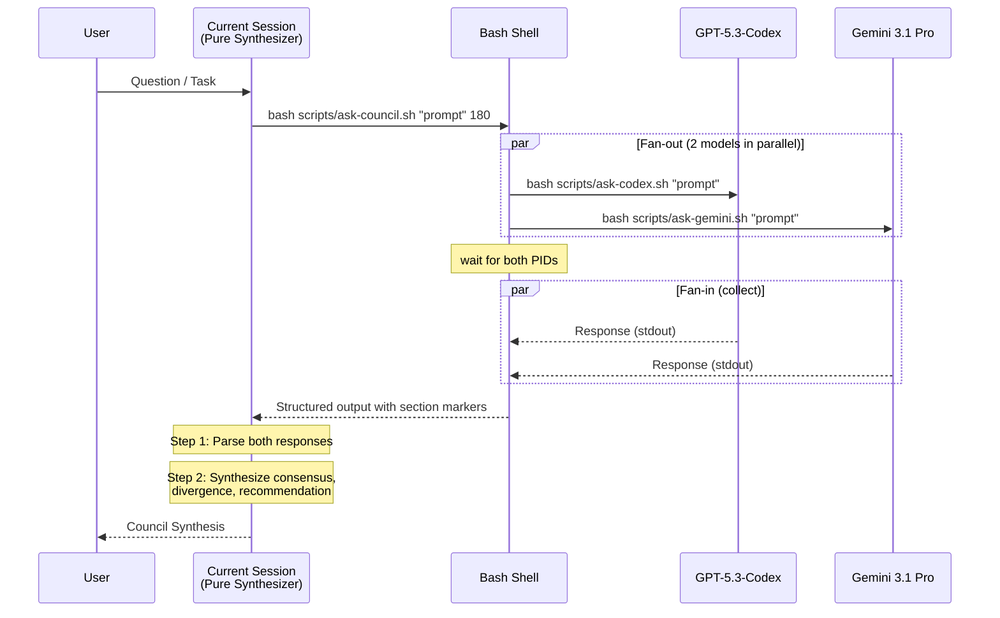

# Architecture

## Overview

The Dual LLM Council implements a **fan-out / fan-in** parallel execution pattern. The current Gemini session acts as a **pure synthesizer**, dispatching the same prompt to two independent model sessions (GPT-5.3-Codex and Gemini 3.1 Pro) in parallel, then synthesizing both perspectives into a unified response.

This design eliminates **self-preference bias** and saves token quotas for primary models like Claude. Because the orchestrating session does not form its own opinion, the synthesis is impartial.

## Model Roles

| Model | Role | Strengths |
|---|---|---|
| **Current Session** | Pure Synthesizer | Parses both responses, synthesizes consensus/divergence/recommendation — does NOT form its own opinion |
| **GPT-5.3-Codex** | Independent advisor | xhigh reasoning effort, code-specialized, strong at structured analysis |
| **Gemini 3.1 Pro** | Independent advisor | Multimodal capabilities, long context window, broad knowledge base |

## Execution Flow



## Bash-Based Parallel Execution

The system uses native Bash process management for parallelism, avoiding the need for any external orchestration framework.

### Pattern: `&` + `wait`

```bash
# Fan-out: launch both processes in background
bash "$SCRIPT_DIR/ask-codex.sh" "$PROMPT" "$TIMEOUT" > "$TMPDIR/codex.txt" 2>"$TMPDIR/codex.err" &
PID_CODEX=$!

bash "$SCRIPT_DIR/ask-gemini.sh" "$PROMPT" "$TIMEOUT" > "$TMPDIR/gemini.txt" 2>"$TMPDIR/gemini.err" &
PID_GEMINI=$!

# Fan-in: wait for both to complete, capture exit codes
EC_CODEX=0; EC_GEMINI=0
wait $PID_CODEX 2>/dev/null || EC_CODEX=$?
wait $PID_GEMINI 2>/dev/null || EC_GEMINI=$?
```

Both models execute simultaneously, so total latency equals the **slower** model rather than the sum.

## Safety Mechanisms

### Script-Level Guards

| Mechanism | Purpose |
|---|---|
| `set -euo pipefail` | Fail on any unhandled error, undefined variable, or pipe failure |
| `trap 'rm -rf "$TMPDIR"' EXIT` | Clean up temp files on any exit (success, failure, or signal) |
| `$TIMEOUT_CMD $TIMEOUT` | Prevent runaway processes; portable timeout execution across macOS and Linux |
| Exit code capture | `wait $PID || EC=$?` captures failure without terminating the script |
| Untrusted Context Wrapper | Protects against prompt injection when reading arbitrary local files via `CONTEXT_FILES` |
| Execution Bit Avoidance | `bash script.sh` instead of `./script.sh` to prevent `Permission denied` on Windows filesystems |

### CLI-Level Guards

| Guard | Codex | Gemini |
|---|---|---|
| Command existence check | `command -v codex` | `command -v gemini` |
| Stderr isolation | Redirected to temp file | Redirected to temp file |
| Sandbox & Approval | `--sandbox read-only --ask-for-approval never` | Configured via `settings.json` schemas |

## Output Parsing

The council script produces structured output with deterministic section markers:

```
=== CODEX / GPT-5.3-Codex RESPONSE (exit: 0) ===
<codex response text>

=== GEMINI / Gemini-3.1-Pro RESPONSE (exit: 0) ===
<gemini response text>
```

The current session parses these markers to extract each model's response, then synthesizes them into the final output format:

```markdown
## Council Synthesis (GPT-5.3 + Gemini 3.1 Pro)

### Consensus
Points where both models agree.

### Divergence
Points where models disagree. Each position explained.

### Recommendation
Synthesized recommendation weighing all perspectives.

---
<details><summary>GPT-5.3-Codex Raw Response</summary>...</details>
<details><summary>Gemini 3.1 Pro Raw Response</summary>...</details>
```

## Script Dependency Graph

```
ask-council.sh
├── ask-codex.sh    → codex exec - (GPT-5.3-Codex)
└── ask-gemini.sh   → gemini (Gemini 3.1 Pro)
```

Each wrapper script is self-contained with its own error handling, timeout fallback, and cleanup logic. The council script only concerns itself with parallel dispatch and output aggregation.

## Team Deliberation Pipeline (`COUNCIL_MODE=team`)

When `COUNCIL_MODE=team` (the default), each model receives a structured prompt template (`council-team-prompt.txt`) that instructs it to simulate an internal team of 3 specialists proceeding through 4 phases.

### 4-Phase Pipeline

| Phase | Role | Purpose |
|---|---|---|
| Phase 1: Research | Researcher | Gather facts, prior art, constraints, identify missing info |
| Phase 2: Analysis | Analyst | Evaluate trade-offs, structured reasoning, initial recommendation |
| Phase 3: Critique | Devil's Advocate | Challenge assumptions, identify edge cases, rate confidence |
| Phase 4: Team Conclusion | Team Lead | Synthesize all phases, state what changed due to critique, final recommendation |

### `COUNCIL_MODE` Environment Variable

| Value | Behavior |
|---|---|
| `fast` | Each model receives the raw question directly (single response, no internal deliberation) |
| `team` (default) | Each model receives the structured 4-phase prompt template |

In `team` mode, the synthesizer focuses primarily on each model's **Phase 4 (Team Conclusion)** for the final synthesis.

### Prompt Symmetry

Both models receive the **identical** prompt template. This is a deliberate design choice:
- No model receives special instructions or a different role
- Each model's unique reasoning style emerges naturally within the same structure
- Diversity can optionally be forced via `COUNCIL_LENS=lens` to assign different optimization criteria (e.g., ROI vs Speed).

## Deep Dive Debate Pipeline (`ask-council-debate.sh`)

For hard problems requiring maximum quality, the debate mode implements a 4+2 round adversarial process. The debate mode creates **inter-model interaction** across multiple rounds and actively patches logical flaws.

### Round Architecture

```
Round 1: Independent Deep Dive (symmetric, parallel)
  ┌─────────┐  ┌─────────┐
  │ Codex    │  │ Gemini   │  ← Up to 6 distinct approaches
  │ 3 options│  │ 3 options│
  │ + Packet │  │ + Packet │
  └────┬─────┘  └────┬─────┘
       │              │
       ▼              ▼
  Decision Packets (15-25 lines each)

Round 2: Cross-Critique (asymmetric inputs, parallel)
  ┌─────────────┐  ┌─────────────┐
  │ Codex sees:  │  │ Gemini sees: │
  │ Own + Gemini │  │ Own + Codex  │
  │ Steelman     │  │ Steelman     │
  │ Attack       │  │ Attack       │
  │ Self-critique│  │ Self-critique│
  │ Revise       │  │ Revise       │
  └──────┬───────┘  └──────┬───────┘
         │                 │
         ▼                 ▼
    Revised Decision Packets

Round 3: Convergence (symmetric inputs, parallel)
  Both models receive both Revised Packets
  ┌──────────────────────────────────────┐
  │ Converged Plan + Decision Tree       │
  │ Verification Plan + Residual Risks   │
  └──────────────────┬───────────────────┘
                     │
                     ▼
            Convergence Packets

Round 4: Audit / Red Team (symmetric, parallel)
  Both models receive the Converged Plan
  ┌──────────────────────────────────────┐
  │ Break-It List + Logic Audit          │
  │ Minority Report + Patches            │
  │ Verdict: APPROVE / REVISE / REJECT   │
  └──────────────────────────────────────┘

Round 5 & 6: Repair Loop (auto-triggered on REVISE/REJECT)
  ┌──────────────────────────────────────┐
  │ Integrate Audit patches into Plan    │
  │ Output Repaired Convergence Packet   │
  │ Optional: Re-Audit Repaired Plan     │
  └──────────────────────────────────────┘
```

### Key Design Decisions

**Decision Packet pattern**: Only compressed summaries (15-25 lines) cross between rounds, not full model outputs. This prevents noise injection.

**Forced diversity in Round 1**: Each model must propose 3 meaningfully different options.

**Adversarial audit in Round 4**: The instruction is explicitly "BREAK this plan" — not "review" or "evaluate."

**Auto-Repair in Round 5**: If flaws are detected in Round 4, models immediately synthesize patches into a fixed, robust strategy.

## Limitations

- **Latency**: Standard council adds 30-120 seconds. Debate mode: 5-20 minutes (4-6 sequential rounds × parallel models).
- **One-shot per round**: Each model receives a single prompt per round. The multi-round structure compensates for lack of real-time dialogue.
- **Text-only**: Despite Gemini's multimodal capabilities, the CLI interface passes text prompts only.
