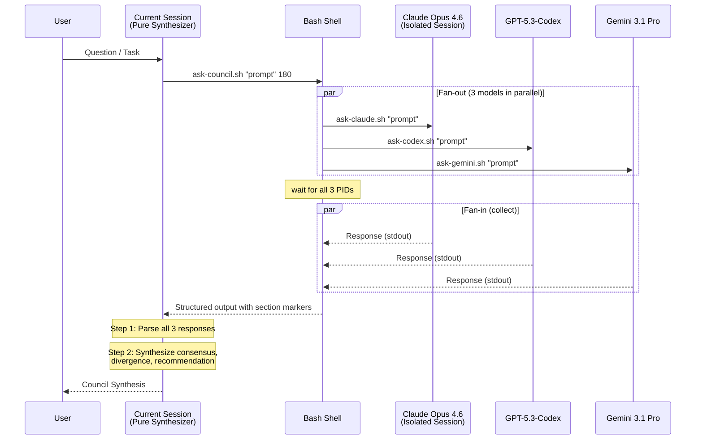
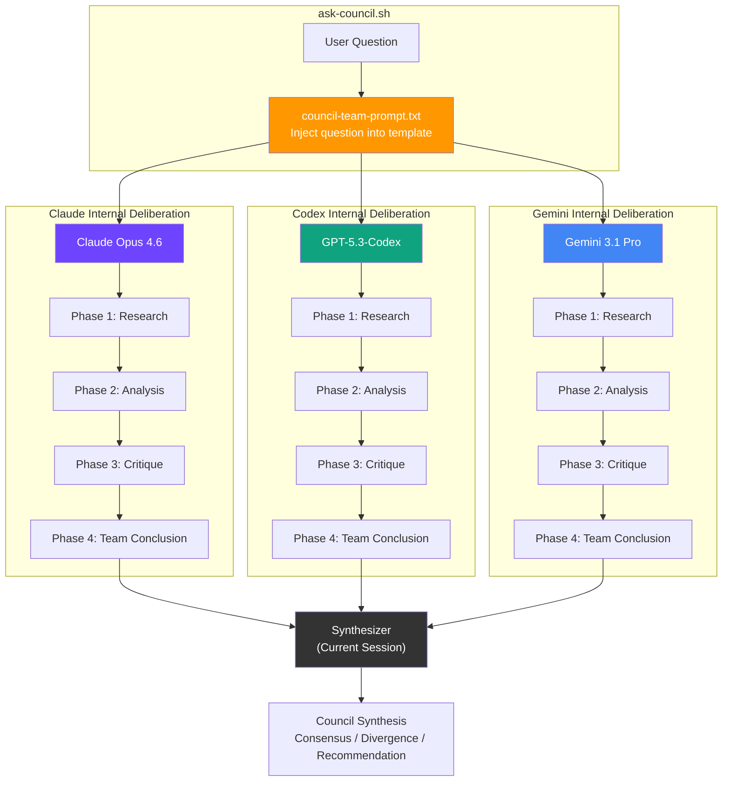

# Architecture

## Overview

The Multi-Model Council implements a **fan-out / fan-in** parallel execution pattern. The current Claude Code session acts as a **pure synthesizer**, dispatching the same prompt to three independent model sessions (Claude Opus 4.6, GPT-5.3-Codex, and Gemini 3.1 Pro) in parallel, then synthesizing all three perspectives into a unified response.

This design eliminates **self-preference bias** — because the orchestrating session does not form its own opinion, the synthesis is impartial. Claude's independent opinion is generated in a separate, context-isolated session via `ask-claude.sh`.

## Model Roles

| Model | Role | Strengths |
|---|---|---|
| **Current Session** | Pure Synthesizer | Parses all three responses, synthesizes consensus/divergence/recommendation — does NOT form its own opinion |
| **Claude Opus 4.6** | Independent advisor | Advanced reasoning, nuanced analysis — runs in isolated session via `ask-claude.sh` (`env -u CLAUDECODE claude -p --no-session-persistence`) |
| **GPT-5.3-Codex** | Independent advisor | xhigh reasoning effort, code-specialized, strong at structured analysis |
| **Gemini 3.1 Pro** | Independent advisor | Multimodal capabilities, long context window, broad knowledge base |

## Execution Flow



## Bash-Based Parallel Execution

The system uses native Bash process management for parallelism, avoiding the need for any external orchestration framework.

### Pattern: `&` + `wait`

```bash
# Fan-out: launch all 3 processes in background
"$SCRIPT_DIR/ask-claude.sh" "$PROMPT" "$TIMEOUT" > "$TMPDIR/claude.txt" 2>"$TMPDIR/claude.err" &
PID_CLAUDE=$!

"$SCRIPT_DIR/ask-codex.sh" "$PROMPT" "$TIMEOUT" > "$TMPDIR/codex.txt" 2>"$TMPDIR/codex.err" &
PID_CODEX=$!

"$SCRIPT_DIR/ask-gemini.sh" "$PROMPT" "$TIMEOUT" > "$TMPDIR/gemini.txt" 2>"$TMPDIR/gemini.err" &
PID_GEMINI=$!

# Fan-in: wait for all 3 to complete, capture exit codes
EC_CLAUDE=0; EC_CODEX=0; EC_GEMINI=0
wait $PID_CLAUDE 2>/dev/null || EC_CLAUDE=$?
wait $PID_CODEX 2>/dev/null || EC_CODEX=$?
wait $PID_GEMINI 2>/dev/null || EC_GEMINI=$?
```

All three models execute simultaneously, so total latency equals the **slowest** model rather than the sum.

### Claude Isolated Session

The `ask-claude.sh` script runs Claude in a **context-isolated session** — separate from the current orchestrating session. This is achieved via:

```bash
env -u CLAUDECODE claude -p "$PROMPT" --model claude-opus-4-6 --no-session-persistence
```

- `env -u CLAUDECODE`: Unsets the `CLAUDECODE` environment variable to avoid a "nested session" error, since Claude Code does not allow running `claude` inside an existing session by default.
- `--no-session-persistence`: Ensures the spawned Claude session is ephemeral and does not persist conversation state.

**Why context isolation matters**: When the orchestrating session also forms its own opinion, it introduces **self-preference bias** — a tendency to weight its own reasoning more heavily during synthesis. By running Claude as an independent, context-isolated participant, the synthesizer treats all three perspectives equally.

## Safety Mechanisms

### Script-Level Guards

| Mechanism | Purpose |
|---|---|
| `set -euo pipefail` | Fail on any unhandled error, undefined variable, or pipe failure |
| `trap 'rm -rf "$TMPDIR"' EXIT` | Clean up temp files on any exit (success, failure, or signal) |
| `timeout $TIMEOUT` | Prevent runaway processes; default 120s per model, 180s for council |
| Exit code capture | `wait $PID || EC=$?` captures failure without terminating the script |

### CLI-Level Guards

| Guard | Claude | Codex | Gemini |
|---|---|---|---|
| Command existence check | `command -v claude` | `command -v codex` | `command -v gemini` |
| Stderr isolation | Redirected to temp file | Redirected to temp file | Redirected to temp file |
| Non-zero exit handling | Reports error + stderr | Reports error + stderr | Reports error + stderr |
| Nested session guard | `env -u CLAUDECODE` | N/A | N/A |

## Output Parsing

The council script produces structured output with deterministic section markers:

```
=== CLAUDE / Claude-Opus-4.6 RESPONSE (exit: 0) ===
<claude response text>

=== CODEX / GPT-5.3-Codex RESPONSE (exit: 0) ===
<codex response text>

=== GEMINI / Gemini-3.1-Pro RESPONSE (exit: 0) ===
<gemini response text>
```

The current session parses these markers to extract each model's response, then synthesizes them into the final output format:

```markdown
## Council Synthesis (Claude Opus 4.6 + GPT-5.3 + Gemini 3.1 Pro)

### Consensus
Points where all 3 models agree.

### Divergence
Points where models disagree. Each position explained.

### Recommendation
Synthesized recommendation weighing all perspectives.

---
<details><summary>Claude Opus 4.6 Raw Response</summary>...</details>
<details><summary>GPT-5.3-Codex Raw Response</summary>...</details>
<details><summary>Gemini 3.1 Pro Raw Response</summary>...</details>
```

## Script Dependency Graph

```
ask-council.sh
├── ask-claude.sh   → env -u CLAUDECODE claude -p (Claude Opus 4.6, isolated session)
├── ask-codex.sh    → codex exec (GPT-5.3-Codex)
└── ask-gemini.sh   → gemini -p  (Gemini 3.1 Pro)
```

Each wrapper script is self-contained with its own error handling, timeout, and cleanup logic. The council script only concerns itself with parallel dispatch and output aggregation.

## Team Deliberation Pipeline (`COUNCIL_MODE=team`)

When `COUNCIL_MODE=team` (the default), each model receives a structured prompt template (`council-team-prompt.txt`) that instructs it to simulate an internal team of 3 specialists proceeding through 4 phases.

### 4-Phase Pipeline

| Phase | Role | Purpose |
|---|---|---|
| Phase 1: Research | Researcher | Gather facts, prior art, constraints, identify missing info |
| Phase 2: Analysis | Analyst | Evaluate trade-offs, structured reasoning, initial recommendation |
| Phase 3: Critique | Devil's Advocate | Challenge assumptions, identify edge cases, rate confidence |
| Phase 4: Team Conclusion | Team Lead | Synthesize all phases, state what changed due to critique, final recommendation |

### Team Deliberation Flow



### `COUNCIL_MODE` Environment Variable

| Value | Behavior |
|---|---|
| `fast` | Each model receives the raw question directly (single response, no internal deliberation) |
| `team` (default) | Each model receives the structured 4-phase prompt template |

In `team` mode, the synthesizer focuses primarily on each model's **Phase 4 (Team Conclusion)** for the final synthesis, while the earlier phases (Research, Analysis, Critique) are available as supporting detail in the raw response sections.

### Prompt Symmetry

All three models receive the **identical** prompt template. This is a deliberate design choice:
- No model receives special instructions or a different role
- Each model's unique reasoning style emerges naturally within the same structure
- The synthesizer can fairly compare Phase 4 conclusions across all 3 models

## Deep Dive Debate Pipeline (`ask-council-debate.sh`)

For hard problems requiring maximum quality, the debate mode implements a 4-round adversarial process. Unlike the standard council (1-round fan-out/fan-in) or team mode (internal 4-phase per model), the debate mode creates **inter-model interaction** across multiple rounds.

### Round Architecture

```
Round 1: Independent Deep Dive (symmetric, parallel)
  ┌─────────┐  ┌─────────┐  ┌─────────┐
  │ Claude   │  │ Codex    │  │ Gemini   │
  │ 3 options│  │ 3 options│  │ 3 options│  ← Up to 9 distinct approaches
  │ + Packet │  │ + Packet │  │ + Packet │
  └────┬─────┘  └────┬─────┘  └────┬─────┘
       │              │              │
       ▼              ▼              ▼
  Decision Packets (15-25 lines each)

Round 2: Cross-Critique (asymmetric inputs, parallel)
  ┌─────────────┐  ┌─────────────┐  ┌─────────────┐
  │ Claude sees: │  │ Codex sees:  │  │ Gemini sees: │
  │ Own + CX + G │  │ Own + CL + G │  │ Own + CL + CX│
  │ Steelman     │  │ Steelman     │  │ Steelman     │
  │ Attack       │  │ Attack       │  │ Attack       │
  │ Self-critique│  │ Self-critique│  │ Self-critique│
  │ Revise       │  │ Revise       │  │ Revise       │
  └──────┬───────┘  └──────┬───────┘  └──────┬───────┘
         │                 │                 │
         ▼                 ▼                 ▼
    Revised Decision Packets

Round 3: Convergence (symmetric inputs, parallel)
  All 3 models receive all 3 Revised Packets
  ┌──────────────────────────────────────┐
  │ Converged Plan + Decision Tree       │
  │ Verification Plan + Residual Risks   │
  └──────────────────┬───────────────────┘
                     │
                     ▼
            Convergence Packets

Round 4: Audit / Red Team (symmetric, parallel)
  All 3 models receive the Converged Plan
  ┌──────────────────────────────────────┐
  │ Break-It List + Logic Audit          │
  │ Minority Report + Patches            │
  │ Verdict: APPROVE / REVISE / REJECT   │
  └──────────────────────────────────────┘
```

### Key Design Decisions

**Decision Packet pattern**: Only compressed summaries (15-25 lines) cross between rounds, not full model outputs. This prevents noise injection — long, detailed text from one model can anchor or overwhelm another model's reasoning. Full analysis is preserved in the transcript for human review.

**Forced diversity in Round 1**: Each model must propose 3 meaningfully different options (not variations). This yields up to 9 distinct approaches from the same input, preventing premature convergence.

**Asymmetric Round 2 inputs**: Each model sees the OTHER two packets plus its own. This ensures genuine cross-examination rather than self-reinforcement.

**Conditional convergence in Round 3**: Models produce a decision tree ("if X then A, if Y then B") rather than forcing a single answer. This preserves the value of diversity while providing actionable guidance.

**Adversarial audit in Round 4**: The instruction is explicitly "BREAK this plan" — not "review" or "evaluate." This framing consistently produces more useful critiques than polite review requests.

## Limitations

- **Prompt-only context by default**: Council members receive the prompt text only. Use `CONTEXT_FILES` to inject local file contents into the prompt (see Context Bridge in README). Note: `CONTEXT_FILES` reads file contents into the prompt *before* the CLI subprocess is launched, so the file data is sent as prompt text. The CLI's own sandbox or approval settings do not apply to content already embedded in the prompt. Paths with `..` traversal are rejected as a basic safety measure.
- **Latency**: Standard council adds 30-120 seconds. Debate mode: 5-20 minutes (4 sequential rounds × parallel models).
- **One-shot per round**: Each model receives a single prompt per round. The multi-round structure compensates for lack of real-time dialogue.
- **Text-only**: Despite Gemini's multimodal capabilities, the CLI interface passes text prompts only.
- **Decision Packet extraction**: Debate mode parses structured output by section headers. If a model doesn't follow the template, fallback truncation is used (degraded but functional).
- **Claude nested session**: The `env -u CLAUDECODE` trick is required to avoid Claude Code's nested session restriction. Without it, `claude -p` will fail with a nested session error.
